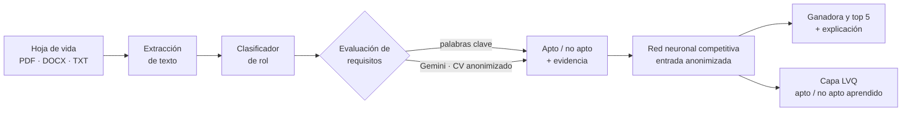

# CVScope

**Sistema inteligente de preselección y categorización de talento humano con
IA explicable.**

Proyecto del curso PTIA (Principios y Tecnologías de Inteligencia Artificial) ·
Escuela Colombiana de Ingeniería Julio Garavito · 2026-2

**Equipo:** Tomás Olaya Díaz y Juan Pablo Vega Villamil

---

## Contenido

1. [¿Qué hace CVScope?](#qué-hace-cvscope)
2. [Historia del proyecto](#historia-del-proyecto)
   - [Hito 1 · Exploración](#hito-1--exploración)
   - [Hito 2 · Datos, evaluación y red neuronal competitiva](#hito-2--datos-evaluación-y-red-neuronal-competitiva)
   - [Mejoras para la sustentación](#25--mejoras-para-la-sustentación)
3. [Cómo se construyó la red neuronal competitiva](#cómo-se-construyó-la-red-neuronal-competitiva)
4. [Datasets](#datasets)
5. [Sesgos y equidad](#sesgos-y-equidad)
6. [Arquitectura del sistema](#arquitectura-del-sistema)
7. [Cómo ejecutar](#cómo-ejecutar)
8. [Próximos pasos](#próximos-pasos)

---

## ¿Qué hace CVScope?

Una empresa recibe muchas hojas de vida para un cargo. CVScope:

1. **Categoriza** cada hoja de vida en un rol (Full Stack, Recursos Humanos,
   Ventas o Marketing Digital).
2. **Selecciona**: decide si cumple los requisitos mínimos del rol (*apto* o
   *no apto*) y **explica** cada requisito citando el fragmento del CV que lo
   demuestra.
3. **Pone a competir** a las hojas de vida del rol en una **red neuronal
   competitiva** y entrega a la ganadora y el **top 5**, con la explicación de
   cada duelo.

Los datos se guardan en una base de datos (SQLite o PostgreSQL) y la aplicación
pide iniciar sesión.



**Stack:** Python + FastAPI · SQLAlchemy (SQLite / PostgreSQL) · NumPy ·
scikit-learn · React 19 + Vite · Gemini 2.5 Flash (vía endpoint compatible con
OpenAI) · Playwright · GitHub Actions · Docker Compose.

---

## Historia del proyecto

### Hito 1 · Exploración

*26 de agosto – 13 de septiembre de 2026 · [PR #1](https://github.com/iAxstral/CVScope/pull/1) (`feat/hito1`)*

El objetivo fue definir el problema y dejar lista la base técnica.

- **Estructura del repositorio**: backend en FastAPI y espacio para el
  frontend en React.
- **Servidor FastAPI** con CORS para el frontend y documentación automática en
  `/docs`.
- **Esquemas Pydantic** para validar roles y candidatos (`schemas/rol.py`,
  `schemas/candidato.py`), incluido el estado de evaluación
  (`pendiente`, `apto`, `no_apto`).
- **Almacenamiento en memoria** (`models/store.py`) con los 4 roles iniciales y
  sus requisitos mínimos.
- **Endpoints** de roles y candidatos (listar, consultar y crear) y los
  esqueletos de preselección, vacantes y del servicio del LLM.

### Hito 2 · Datos, evaluación y red neuronal competitiva

*14 de septiembre – octubre de 2026*

El hito 2 convirtió la base en un sistema que funciona de punta a punta. Se
trabajó en cinco entregas:

#### 2.1 · Clasificador de rol y primer frontend
*`feat/hito2`*

- **Clasificador de rol**: embeddings `all-MiniLM-L6-v2` (sentence-transformers)
  + regresión logística (`ml_models/clasificador_rol.pkl`).
- `POST /preseleccion/categorizar`: predice el rol de una hoja de vida.
- **Primer frontend** en React: login, dashboard de roles, carga de candidatos
  y vistas de ranking y detalle (aún con datos de ejemplo).

#### 2.2 · Datasets, evaluación explicable y top 5
*[PR #2](https://github.com/iAxstral/CVScope/pull/2) (`feat/hito2-s11`)*

- **Dos datasets** reproducibles: uno de **selección** (240 hojas de vida con
  rol y apto/no apto) y uno de **ranking** (60 hojas de vida con puntaje y
  posición de referencia). Ver [Datasets](#datasets).
- **Evaluador de requisitos explicable**: marca cada requisito como cumplido o
  no y muestra el fragmento del CV que lo sustenta.
- Endpoints para **evaluar**, obtener el **top 5** por rol, ver el **detalle**
  de una hoja de vida y consultar los datasets.
- **Rediseño del frontend** conectado a la API real: dashboard con indicadores,
  "Seleccionar CV", "Ranking top 5", detalle explicable y página de datasets.

#### 2.3 · Primera versión de la red neuronal
*[PR #3](https://github.com/iAxstral/CVScope/pull/3) (`feat/redNeuronal`)*

- **Red siamesa** en NumPy que asigna a cada hoja de vida una fuerza y compara
  pares.
- **Torneo de eliminación directa**: las hojas de vida se enfrentan de a dos y
  la mejor avanza.
- Página "Red competitiva" con el cuadro del torneo y el duelo directo.

#### 2.4 · Red competitiva MAXNET, Gemini, archivos y sesgos
*`feat/hito2-3`*

- **Capa competitiva MAXNET**: la red pasa a ser una **red competitiva tipo
  Hamming** con inhibición lateral (*winner-take-all*).
- **Gemini** como segundo motor de evaluación, con citas verificadas.
- **Extracción de texto** de PDF, DOCX y TXT.
- **Anonimización** de las hojas de vida y **auditoría de sesgos** con
  contrafactuales.
- **Diagrama** de la red en draw.io ([docs/diagrama](docs/diagrama/README.md))
  y documento de [sesgos y equidad](docs/sesgos.md).

#### 2.5 · Mejoras para la sustentación
*`feat/mejoras`*

- **Un solo top 5**: el ranking lo decide la red competitiva (el mismo podio
  de la página "Red competitiva"); el orden por palabras clave queda como
  comparación.
- **Capa competitiva que aprende (LVQ)** para decidir apto / no apto.
- **Validación estadística**: validación cruzada e intervalos de confianza.
- **Base de datos** con SQLAlchemy (SQLite por defecto, PostgreSQL con
  `DATABASE_URL`), **login real** y **roles configurables** desde la interfaz
  (con su propio umbral de apto).
- **Calidad**: dependencias fijadas, CI en GitHub Actions (backend contra SQLite
  y PostgreSQL, auditoría de sesgos, lint, build y pruebas de punta a punta con
  Playwright) y `docker compose` para levantar todo.

---

## Cómo se construyó la red neuronal competitiva


*Diagrama editable: [`docs/diagrama/red_competitiva.drawio`](docs/diagrama/red_competitiva.drawio) ·
guía de lectura: [`docs/diagrama/README.md`](docs/diagrama/README.md)*

### El problema

Ordenar hojas de vida es, en el fondo, **hacerlas competir**: no importa tanto
el puntaje absoluto de cada una, sino cuál es mejor que cuál para el cargo. Por
eso elegimos una **red neuronal competitiva**: cada hoja de vida es una
neurona y las neuronas compiten entre sí hasta que solo queda una ganadora.

La arquitectura sigue a la **red de Hamming** (Hagan, *Neural Network Design*,
cap. 16; Lippmann, 1987), la red competitiva clásica, que tiene dos capas:

| Capa | Tipo | Qué hace en CVScope |
|---|---|---|
| **Capa de evaluación** | Feedforward, **entrenada** | Calcula la fuerza de cada hoja de vida para el rol. |
| **Capa competitiva (MAXNET)** | Recurrente, pesos fijos | Las neuronas se inhiben entre sí hasta que solo una queda activa. |
| **Capa competitiva LVQ** | Competitiva, **entrenada** (Kohonen) | Neuronas prototipo de «apto» y «no apto»; gana la más cercana. |

### Paso 1 · Preparar los datos

Antes de entrar a la red, cada hoja de vida se **anonimiza**
(`services/anonimizador.py`): se quitan nombre, ciudad, edad, estado civil,
género y datos de contacto, para que la red no pueda aprender sesgos con ellos.

### Paso 2 · Convertir el texto en números

Cada hoja de vida se vuelve un vector `x` de **1026 características**
(`red_competitiva/caracteristicas.py`):

| Posición | Característica | Por qué |
|---|---|---|
| `x₁` | Fracción de requisitos del rol con evidencia en el texto | Es el criterio principal del cargo. |
| `x₂` | Años de experiencia ÷ 12 (con tope) | Segundo criterio del cargo. |
| `x₃ … x₁₀₂₆` | 1024 n-gramas (palabras y pares de palabras) con *hashing* | Permite reconocer requisitos escritos sin las palabras clave, por ejemplo "componentes reutilizables" como señal de React. |

El *hashing* (`crc32` módulo 1024) da un tamaño fijo sin necesidad de guardar
un vocabulario, y los conteos se suavizan con `log(1 + n)` y se normalizan.

### Paso 3 · La capa de evaluación (feedforward)

Implementada desde cero en NumPy (`red_competitiva/modelo.py`):

```
x (1026) → Densa 64 + ReLU → Densa 32 + ReLU → Densa 1 → s(x) = fuerza
```

- **Pesos compartidos (siamesa)**: todas las hojas de vida pasan por la misma
  red, así sus fuerzas son comparables.
- **Inicialización He**, adecuada para ReLU.
- **Probabilidad de un duelo**: `P(A gana a B) = σ(s(A) − s(B))`. Así el duelo
  es siempre consistente: `P(A > B) = 1 − P(B > A)` y una hoja de vida contra sí
  misma da 0.5.

### Paso 4 · Entrenar la capa de evaluación

La red aprende **comparando pares** (enfoque tipo RankNet), con el script
`scripts/entrenar_red_competitiva.py`:

1. **Duelos de entrenamiento**: todos los pares de hojas de vida del **mismo
   rol** del dataset de selección. Gana la de mayor puntaje de referencia
   (requisitos realmente cumplidos + experiencia); si empatan, la etiqueta es 0.5.
2. **División**: 80 % de las hojas de vida para entrenar (4.512 duelos) y 20 %
   para validar (257 duelos). La **prueba** se hace con el dataset de ranking
   (411 duelos), que la red nunca ve.
3. **Pérdida**: entropía cruzada binaria sobre `σ(s(A) − s(B))`.
4. **Retropropagación** escrita a mano (los gradientes de A y de B se suman
   porque comparten pesos) y **Adam** con regularización **L2**.
5. **Hiperparámetros**: 40 épocas, lotes de 128, tasa de aprendizaje 0.002,
   L2 = 0.0001, semilla 2026. En cada lote el orden A/B se invierte al azar
   para que la red no aprenda la posición.

El gradiente se verificó contra **diferencias finitas** (error relativo ~10⁻⁹),
y hay una prueba automática que lo comprueba.

### Paso 5 · La capa competitiva MAXNET

Implementada en `red_competitiva/competitiva.py`. Hay **una neurona por hoja de
vida**:

1. Cada neurona arranca con la fuerza que le dio la capa de evaluación:
   `aᵢ(0) = exp(sᵢ − max s)`, un valor entre 0 y 1.
2. En cada iteración cada neurona **se refuerza a sí misma** (peso `+1`) e
   **inhibe a las demás** (peso `−ε`):

   ```
   aᵢ(t+1) = max(0, aᵢ(t) − ε · Σⱼ≠ᵢ aⱼ(t))      con 0 < ε < 1/(S − 1)
   ```

3. Las neuronas débiles llegan a 0 y se apagan. La competencia termina cuando
   **solo queda una activa**: la ganadora (*winner-take-all*).

Usamos `ε = 0.5 / (S − 1)`, la mitad del máximo que garantiza la convergencia.
Los empates exactos se resuelven a favor de la primera sembrada (si no, las dos
neuronas se apagarían al mismo ritmo para siempre).

**Ejemplo real** de un duelo (fuerzas 23.4 y 23.2, ε = 0.5):

| Iteración | Neurona A | Neurona B |
|---|---|---|
| 0 | 1.00 | 0.82 |
| 1 | 0.59 | 0.32 |
| 2 | 0.43 | 0.02 |
| 3 | 0.42 | **0.00** → se apaga |

### Paso 6 · Salidas

- **Ganadora** (vector one-hot) y **probabilidad de ganar** de cada hoja de
  vida: `softmax(s)`, que en un duelo es `σ(s_A − s_B)`.
- **Top 5**: se retira a la ganadora y se repite la competencia.
- **Torneo** (`red_competitiva/torneo.py`): eliminación directa donde cada
  duelo es una MAXNET de 2 neuronas; si los participantes no son potencia de 2,
  los primeros sembrados pasan la primera ronda sin jugar.
- **Explicación** de cada duelo: requisitos con evidencia de cada una,
  experiencia e iteraciones de inhibición.

En la página "Red competitiva" del frontend se ve el cuadro del torneo, la
competencia abierta y un gráfico de cómo se apagan las neuronas en cada
iteración. La página "Ranking top 5" muestra el mismo podio y permite
compararlo con el orden por palabras clave.

### Paso 7 · Una capa competitiva que aprende: LVQ

MAXNET decide, pero no aprende (sus pesos `+1` y `−ε` son fijos). Para que la
parte competitiva también aprenda de los datos, se agregó una capa **LVQ**
(*Learning Vector Quantization*, Kohonen) que decide **apto / no apto**
(`red_competitiva/lvq.py`, entrenada con `scripts/entrenar_lvq.py`):

1. Tiene 4 **neuronas prototipo** (2 «apto» y 2 «no apto»), cada una con un
   vector de pesos `w_k` del mismo tamaño que `x`.
2. Ante una hoja de vida **gana la neurona más cercana**,
   `k* = argmin ‖x − w_k‖`, y su clase es el veredicto.
3. **Regla de Kohonen**: al entrenar, solo la ganadora se mueve; se acerca a la
   hoja de vida si acertó (`w ← w + α(x − w)`) y se aleja si falló
   (`w ← w − α(x − w)`), con `α` decreciendo de 0.05 a 0 en 40 épocas.

La configuración (peso 3 para los rasgos explícitos, 2 prototipos por clase)
se eligió en validación. Lo que aprendió es interpretable: los prototipos
«apto» quedaron en ~0.8 de requisitos cumplidos y los «no apto» entre 0.1 y
0.25, y además se separaron solos por experiencia (~3.5 y ~10 años). En prueba
**iguala** al evaluador por palabras clave (exactitud 0.983 en ambos; F1 0.988
frente a 0.987), pero la frontera la aprendió de los datos en vez de usar un
umbral fijo. Su veredicto aparece en "Seleccionar CV" y en la red competitiva.

### Evolución y resultados

Métricas sobre el dataset de ranking (datos que la red no vio al entrenar):

| Versión | Cambio | Exactitud en duelos | Precisión@5 | Confianza en empates* |
|---|---|---|---|---|
| Línea base | Evaluador por palabras clave | 0.934 | 0.70 | — |
| v1 | Primera red siamesa | 0.949 | 0.80 | 0.80 |
| v2 | Entrenar también con empates (etiqueta 0.5) | 0.956 | 0.80 | 0.61 |
| v3 | Entrada anonimizada | 0.961 | 0.80 | 0.49 |
| **v4 (actual)** | Sin marcadores de anonimización | **0.959** | **0.80** | **0.45** |

\* *Qué tan segura está la red cuando dos hojas de vida en realidad son
equivalentes: 0 = duda (lo correcto), 1 = segura. Bajarla evita declarar
ganadores con 99 % de seguridad entre hojas de vida iguales.*

- La capa MAXNET (agregada junto con la v3) no cambia estas métricas: en la
  competencia siempre gana la neurona con mayor fuerza. Lo que cambia es *cómo*
  se decide y se explica: por inhibición lateral, iteración por iteración.
- La red supera a la línea base porque reconoce requisitos escritos sin las
  palabras clave: en Full Stack recupera 4 de 5 del top real, frente a 2 de 5.
- La v4 pierde 0.002 de exactitud frente a la v3 a cambio de eliminar una
  fuga de sesgo por edad (ver [Sesgos y equidad](#sesgos-y-equidad)).
- En la línea base de esta tabla la precisión@5 es 0.70 porque se ordena
  directamente por puntaje; `scripts/evaluar_datasets.py` reporta 0.75 porque
  primero filtra solo a los aptos.

### ¿La mejora es estadísticamente significativa?

`scripts/validar_red.py` responde esa pregunta con dos análisis:

- **Validación cruzada de 5 particiones** (dataset de selección, exactitud en
  duelos): red **0.953 ± 0.014**, palabras clave **0.944 ± 0.023**. La red
  gana en 3 de 5 particiones y es más estable.
- **Bootstrap de 2.000 remuestreos** de la prueba (intervalos del 95 %):

| Métrica | Red | Palabras clave | Diferencia (IC 95 %) |
|---|---|---|---|
| Exactitud en duelos | 0.959 [0.909, 0.990] | 0.934 [0.875, 0.982] | +0.024 [−0.042, +0.087] |
| Precisión@5 | 0.80 [0.75, 1.00] | 0.70 [0.65, 0.95] | +0.10 [−0.10, +0.30] |

**Conclusión honesta:** la red es mejor en promedio, pero con 60 hojas de vida
de prueba el intervalo de la diferencia incluye el 0, así que **todavía no se
puede afirmar que la mejora sea significativa**. Hace falta un conjunto de
prueba más grande (idealmente con hojas de vida reales) para confirmarlo.

### Cómo se validó

- **79 pruebas del backend** (`backend/tests/`): gradiente con diferencias
  finitas, antisimetría de las probabilidades, MAXNET (gana la más fuerte y
  queda una sola activa), LVQ (aprende, regla de Kohonen), torneo, que el
  ranking coincida con el podio de la red, anonimizador, Gemini con un cliente
  simulado, extracción de PDF/DOCX, persistencia, umbral por rol,
  autenticación y los endpoints. Corren también contra PostgreSQL 16.
- **16 pruebas de punta a punta** con Playwright (escritorio y móvil) sobre el
  backend y el frontend reales.
- **Auditoría de sesgos** con contrafactuales (`scripts/auditar_sesgos.py`),
  que el CI ejecuta en cada cambio.

---

## Datasets

Ambos son **sintéticos y reproducibles** (`python scripts/generar_datasets.py`,
semilla fija). Incluyen ruido a propósito: requisitos descritos de forma
indirecta y menciones negadas ("sin experiencia en nómina").

| Dataset | Archivo | Hojas de vida | Uso |
|---|---|---|---|
| **Selección** | `backend/data/dataset_seleccion.csv` | 240 (60 por rol) | Rol y apto/no apto. Entrena la red competitiva y la capa LVQ y valida la selección; sirve también para reentrenar el clasificador de rol. |
| **Ranking** | `backend/data/dataset_ranking.csv` | 60 (15 por rol) | Puntaje y posición de referencia. Prueba la red y el top 5. |

Métricas del evaluador por palabras clave (`python scripts/evaluar_datasets.py`):

- **Selección**: exactitud 0.954 · precisión 1.000 · recall 0.917 · F1 0.957
- **Ranking**: precisión@5 promedio 0.75

Para medir a Gemini contra esta línea base (requiere API key):
`python scripts/evaluar_llm.py --n 40`.

---

## Sesgos y equidad

Antes de que la red competitiva o Gemini vean una hoja de vida se quitan
nombre, ciudad, edad, estado civil, género y datos de contacto. Una **auditoría con
contrafactuales** cambia solo uno de esos datos en cada hoja de vida y mide
cuánto cambia la evaluación:

| Dato cambiado | Variación de la fuerza (red) | Variación del puntaje (palabras clave) |
|---|---|---|
| Nombre | 0 | 0 |
| Ciudad | 0 | 0 |
| Género | 0 | 0 |
| Edad y estado civil | 0 | 0 |

La auditoría **encontró dos fugas reales** que se corrigieron: una ciudad
fuera de la lista (Quibdó) cambiaba la fuerza hasta 4.8 puntos, y mencionar la
edad la cambiaba hasta 5.7. El CI corre esta auditoría en cada cambio y falla
si reaparece una fuga. Detalles, limitaciones y uso responsable en
[docs/sesgos.md](docs/sesgos.md).

---

## Arquitectura del sistema

```
CVScope/
├── .github/workflows/     # CI: backend (SQLite y PostgreSQL), frontend y e2e
├── docker-compose.yml     # PostgreSQL + API + frontend
├── backend/
│   ├── app/
│   │   ├── main.py
│   │   ├── db.py          # conexión (SQLite por defecto, PostgreSQL con DATABASE_URL)
│   │   ├── dependencias.py  # sesión obligatoria en los endpoints
│   │   ├── routers/       # auth, roles, candidatos, preseleccion, competencia, datasets
│   │   ├── services/
│   │   │   ├── red_competitiva/   # caracteristicas, modelo, competitiva (MAXNET), lvq, torneo, servicio
│   │   │   ├── auth.py                   # contraseñas (PBKDF2) y tokens firmados
│   │   │   ├── anonimizador.py
│   │   │   ├── evaluador_requisitos.py   # motor de palabras clave
│   │   │   ├── llm_service.py            # motor Gemini
│   │   │   ├── extractor_texto.py        # PDF, DOCX, TXT
│   │   │   └── ia_services.py            # clasificador de rol
│   │   ├── models/        # tablas SQLAlchemy y stores (roles, candidatos, usuarios)
│   │   ├── schemas/       # esquemas Pydantic
│   │   └── ml_models/     # clasificador_rol.pkl, red_competitiva.npz, lvq_seleccion.npz
│   ├── data/              # dataset_seleccion.csv, dataset_ranking.csv
│   ├── scripts/           # generar datasets, entrenar, validar, evaluar y auditar sesgos
│   └── tests/             # pruebas (pytest)
├── docs/
│   ├── diagrama/          # diagrama de la red (.drawio, .svg, .png)
│   └── sesgos.md
└── frontend/
    ├── e2e/               # pruebas de punta a punta (Playwright)
    └── src/
        ├── api/           # cliente HTTP del backend
        ├── components/    # bracket, gráfico MAXNET, duelo directo…
        ├── pages/         # Dashboard, Seleccionar CV, Ranking, Red competitiva, Detalle, Datasets
        ├── hooks/
        └── utils/
```

### Endpoints principales

Todos los endpoints, salvo `/auth/login`, requieren la cabecera
`Authorization: Bearer <token>`.

| Método | Ruta | Descripción |
|---|---|---|
| POST | `/auth/login` | Inicia sesión y devuelve el token (8 horas) |
| GET | `/auth/yo` · POST `/auth/usuarios` | Usuario actual · crear otro usuario |
| GET · POST | `/roles/` | Listar roles · crear uno con sus requisitos y su `umbral_apto` |
| POST | `/preseleccion/extraer-texto` | Extrae el texto de un CV en PDF, DOCX o TXT |
| POST | `/preseleccion/categorizar` | Rol predicho por el clasificador |
| POST | `/preseleccion/evaluar` | Apto/no apto con evidencia y veredicto LVQ; `motor`: `palabras_clave` o `llm` (Gemini) |
| GET | `/preseleccion/motores` | Indica si Gemini está disponible |
| GET | `/preseleccion/ranking/{rol_id}?top=5&metodo=red` | Top N del rol según la red (o `metodo=palabras_clave`) y el top del otro método |
| GET | `/preseleccion/hojas-de-vida/{cv_id}` | Detalle explicable de una hoja de vida |
| POST | `/competencia/comparar` | Duelo entre dos hojas de vida (MAXNET de 2 neuronas) |
| POST | `/competencia/torneo` | Torneo, competencia abierta, ganadora y top N |
| GET | `/competencia/modelo` | Arquitectura, métricas y prototipos de la LVQ |
| GET | `/datasets/`, `/datasets/seleccion`, `/datasets/ranking` | Resumen y consulta de los datasets |

La documentación interactiva completa está en `http://127.0.0.1:8000/docs`.

---

## Cómo ejecutar

**Usuario inicial:** `admin@cvscope.co` / `cvscope2026` (se crea la primera vez;
cámbialo con `ADMIN_EMAIL` y `ADMIN_PASSWORD`).

### Opción A · Docker (todo en un comando)

```bash
docker compose up --build
# Frontend: http://localhost:8080 · API: http://localhost:8000/docs
```

Levanta PostgreSQL 16, la API y el frontend (nginx). Para incluir el
clasificador de rol (instala PyTorch): `CON_CLASIFICADOR=true docker compose up --build`.

### Opción B · Local

**Backend**

```bash
cd backend
python -m venv .venv
source .venv/bin/activate      # En Windows: .venv\Scripts\Activate.ps1
pip install -r requirements.txt   # o requirements-api.txt sin el clasificador (más liviano)
cp .env.example .env           # define AUTH_SECRET; opcional: API key de Gemini
uvicorn app.main:app --reload  # http://127.0.0.1:8000
```

Sin `DATABASE_URL` usa SQLite (`backend/cvscope.db`). Sin API key todo funciona
con el motor de palabras clave; con `OPENAI_API_KEY` se habilita Gemini en
"Seleccionar CV".

**Frontend**

```bash
cd frontend
npm install
npm run dev                    # http://localhost:5173
```

El frontend usa `VITE_API_URL` (por defecto `http://127.0.0.1:8000`).

### Pruebas y scripts (desde `backend/`)

| Comando | Para qué |
|---|---|
| `pip install -r requirements-dev.txt && python -m pytest` | Corre las 79 pruebas (con `DATABASE_URL=postgresql://...` las corre contra PostgreSQL) |
| `python scripts/validar_red.py` | Validación cruzada e intervalos de confianza de la red |
| `python scripts/entrenar_lvq.py` | Entrena la capa competitiva LVQ |
| `python scripts/generar_datasets.py` | Regenera los dos datasets |
| `python scripts/entrenar_red_competitiva.py` | Entrena la red y reporta métricas |
| `python scripts/evaluar_datasets.py` | Mide el evaluador por palabras clave |
| `python scripts/auditar_sesgos.py` | Auditoría de sesgos con contrafactuales |
| `python scripts/evaluar_llm.py --n 40` | Compara Gemini con la línea base (requiere API key) |
| `python scripts/entrenar_clasificador_rol.py` | Reentrena el clasificador de rol (requiere acceso a Hugging Face) |
| `python ../docs/diagrama/generar_diagrama.py` | Regenera el diagrama de la red |
| `cd ../frontend && npm run test:e2e` | Pruebas de punta a punta (levanta backend y frontend solos) |

---

## Próximos pasos

- **Medir Gemini** con la API key (`python scripts/evaluar_llm.py --n 40`) y
  compararlo con la red y la línea base.
- **Hojas de vida reales** anonimizadas y etiquetadas a mano: con más datos de
  prueba se podrá confirmar si la mejora de la red es significativa, y hay que
  repetir la auditoría de sesgos.
- **Reentrenar el clasificador de rol** con el dataset de selección
  (`scripts/entrenar_clasificador_rol.py`, requiere acceso a Hugging Face).
- **Migraciones de base de datos** (por ejemplo, Alembic) si el esquema
  cambia con datos ya cargados.
