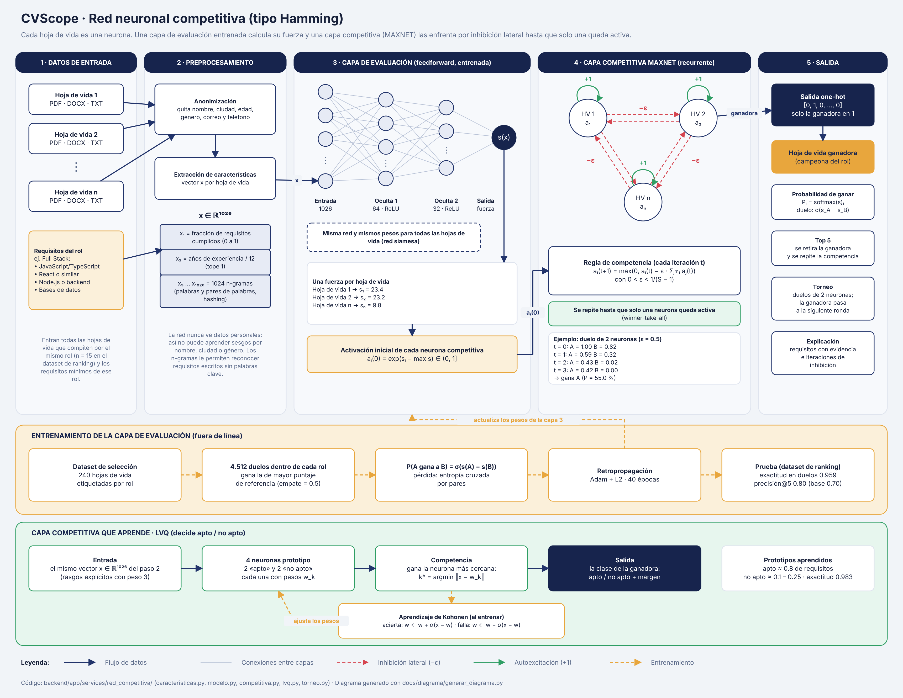

# Diagrama: red neuronal competitiva de CVScope



| Archivo | Para qué sirve |
|---|---|
| [`red_competitiva.drawio`](red_competitiva.drawio) | Diagrama editable. Se abre en [diagrams.net](https://app.diagrams.net) (Archivo › Abrir desde › Dispositivo) o con la extensión de draw.io para VS Code. |
| [`red_competitiva.svg`](red_competitiva.svg) | Imagen vectorial (GitHub la muestra directamente). |
| [`red_competitiva.png`](red_competitiva.png) | Imagen para presentaciones e informes. |
| [`generar_diagrama.py`](generar_diagrama.py) | Genera el `.drawio` y el `.svg` desde una sola definición: `python docs/diagrama/generar_diagrama.py` |

## La idea en una frase

Cada hoja de vida es una **neurona**. Una capa entrenada le da a cada una una
**fuerza**, y en la **capa competitiva** todas se inhiben entre sí hasta que
solo una queda encendida: esa es la **ganadora** (*winner-take-all*).

Es la arquitectura de la **red de Hamming**, la red competitiva clásica
(Hagan, *Neural Network Design*, cap. 16; Lippmann, 1987): una capa
*feedforward* que puntúa cada entrada y una capa **recurrente MAXNET** con
inhibición lateral que elige a la ganadora.

## Paso a paso

### 1 · Datos de entrada
- El **texto de cada hoja de vida** que compite por el rol (PDF, DOCX o TXT; el
  backend extrae el texto). En el dataset de ranking compiten 15 por rol.
- Los **requisitos mínimos del rol** (por ejemplo, para Full Stack:
  JavaScript/TypeScript, React o similar, Node.js o backend, bases de datos).

### 2 · Preprocesamiento
1. **Anonimización**: se quitan nombre, ciudad, edad, fecha de nacimiento,
   estado civil, sexo, correo, teléfono y documento, y se neutraliza el género
   de las profesiones (*ingeniera/ingeniero → ingenierx*). La red nunca ve
   datos personales, así que no puede aprender sesgos con ellos.
2. **Vector de características** `x` de 1026 números por hoja de vida:

| Posición | Qué es | Rango |
|---|---|---|
| `x₁` | Fracción de requisitos del rol con evidencia en el texto | 0 a 1 |
| `x₂` | Años de experiencia ÷ 12 (con tope) | 0 a 1 |
| `x₃ … x₁₀₂₆` | 1024 n-gramas (palabras y pares de palabras) con *hashing* | normalizados |

Los n-gramas le permiten a la red reconocer requisitos escritos sin las
palabras clave (por ejemplo, "componentes reutilizables" como señal de React).

### 3 · Capa de evaluación (feedforward, entrenada)
Una red de `1026 → 64 → 32 → 1` neuronas con ReLU convierte el vector `x` en un
solo número: la **fuerza** `s(x)` de esa hoja de vida para el rol. Es la
**misma red con los mismos pesos** para todas (red siamesa), así las fuerzas
son comparables.

**Salida de la capa**: una fuerza por hoja de vida (`s₁, s₂, …, sₙ`), que se
convierte en la activación inicial de la neurona competitiva:
`aᵢ(0) = exp(sᵢ − max s)`, un valor entre 0 y 1 (la más fuerte arranca en 1).

### 4 · Capa competitiva MAXNET (recurrente)
Hay una neurona por hoja de vida. En cada iteración cada neurona:
- se **refuerza a sí misma** con peso `+1` (flechas verdes), y
- **inhibe a las demás** con peso `−ε` (flechas rojas punteadas).

```
aᵢ(t+1) = max(0, aᵢ(t) − ε · Σⱼ≠ᵢ aⱼ(t))      con 0 < ε < 1/(S − 1)
```

Las neuronas débiles van llegando a 0 (se apagan). La competencia termina
cuando **solo queda una activa**.

**Ejemplo real (duelo de 2 hojas de vida, ε = 0.5)** con fuerzas 23.4 y 23.2:

| Iteración | Neurona A | Neurona B |
|---|---|---|
| 0 | 1.00 | 0.82 |
| 1 | 0.59 | 0.32 |
| 2 | 0.43 | 0.02 |
| 3 | 0.42 | 0.00 → se apaga |

Gana A. La probabilidad que se reporta es `softmax(s)`, que para dos hojas de
vida es `σ(s_A − s_B)` = σ(0.2) = 55.0 %.

### 5 · Salida
- **Vector one-hot**: `[0, 1, 0, …, 0]`, un 1 solo en la neurona ganadora.
- **Hoja de vida ganadora** del rol.
- **Probabilidad de ganar** de cada una (`softmax` de las fuerzas).
- **Top 5**: se retira a la ganadora y se vuelve a correr la competencia.
- **Torneo**: también se puede jugar por eliminación directa; cada duelo es
  una MAXNET de 2 neuronas y la ganadora pasa a la siguiente ronda.
- **Explicación** de cada duelo: requisitos con evidencia de cada hoja de vida,
  experiencia e iteraciones de inhibición.

### Entrenamiento (fuera de línea)
Solo se entrena la **capa de evaluación**; la capa competitiva no tiene pesos
que aprender (sus pesos son `+1` y `−ε`, fijos).

1. **Datos**: dataset de selección (240 hojas de vida etiquetadas).
2. **Duelos**: 4.512 pares de hojas de vida del mismo rol; gana la de mayor
   puntaje de referencia y los empates se etiquetan 0.5.
3. **Pérdida**: `P(A gana a B) = σ(s(A) − s(B))` con entropía cruzada por pares.
4. **Optimización**: retropropagación con Adam + L2, 40 épocas.
5. **Prueba** con el dataset de ranking (que la red nunca vio):

| Métrica | Red competitiva | Palabras clave (línea base) |
|---|---|---|
| Exactitud en duelos | 0.959 | 0.934 |
| Precisión@5 | 0.80 | 0.70 |

### Capa competitiva que aprende: LVQ (franja verde)

MAXNET tiene pesos fijos (`+1` y `−ε`): decide, pero no aprende. Por eso hay
una segunda capa competitiva, **LVQ** (*Learning Vector Quantization*,
Kohonen), que sí aprende y decide **apto / no apto**:

1. **Entrada**: el mismo vector `x` del paso 2 (los dos rasgos explícitos
   pesan 3 veces más al medir distancias).
2. **Neuronas prototipo**: 4 neuronas, 2 de clase «apto» y 2 de «no apto»,
   cada una con un vector de pesos `w_k`.
3. **Competencia**: gana la neurona más cercana, `k* = argmin ‖x − w_k‖`
   (*winner-take-all*); su clase es el veredicto.
4. **Aprendizaje de Kohonen**: al entrenar, solo la ganadora se mueve: se
   **acerca** a la hoja de vida si su clase era la correcta
   (`w ← w + α(x − w)`) y se **aleja** si no (`w ← w − α(x − w)`), con `α`
   decreciendo de 0.05 a 0.

Lo que aprendió (prototipos en unidades originales):

| Neurona | Clase | Fracción de requisitos | Años de experiencia |
|---|---|---|---|
| 0 | No apto | 0.12 | 3.5 |
| 1 | No apto | 0.25 | 10.0 |
| 2 | Apto | 0.77 | 10.7 |
| 3 | Apto | 0.82 | 3.7 |

Nadie le dio el umbral del 66 %: la frontera entre «apto» y «no apto» la
aprendió de los datos, y además separó por su cuenta perfiles con poca y con
mucha experiencia. En prueba iguala al evaluador por palabras clave
(exactitud 0.983 en ambos; F1 0.988 frente a 0.987).

## Dónde está en el código

| Etapa | Archivo |
|---|---|
| Anonimización | `backend/app/services/anonimizador.py` |
| Vector de características | `backend/app/services/red_competitiva/caracteristicas.py` |
| Capa de evaluación | `backend/app/services/red_competitiva/modelo.py` |
| Capa competitiva MAXNET | `backend/app/services/red_competitiva/competitiva.py` |
| Capa competitiva LVQ | `backend/app/services/red_competitiva/lvq.py` |
| Torneo | `backend/app/services/red_competitiva/torneo.py` |
| API (`/competencia/...`) | `backend/app/routers/competencia.py` |
| Entrenamiento | `backend/scripts/entrenar_red_competitiva.py`, `backend/scripts/entrenar_lvq.py` |
| Validación estadística | `backend/scripts/validar_red.py` |
| Interfaz | `frontend/src/pages/Torneo.jsx` (página "Red competitiva") |
